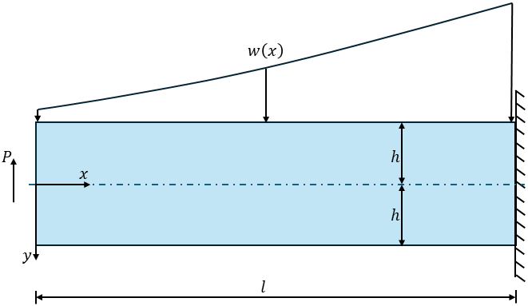
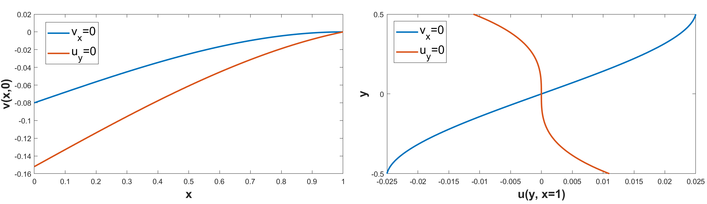
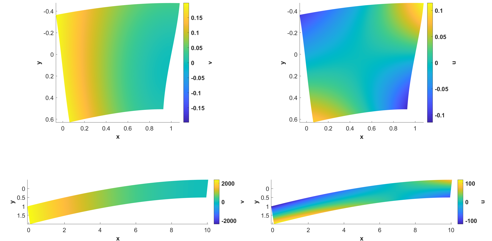
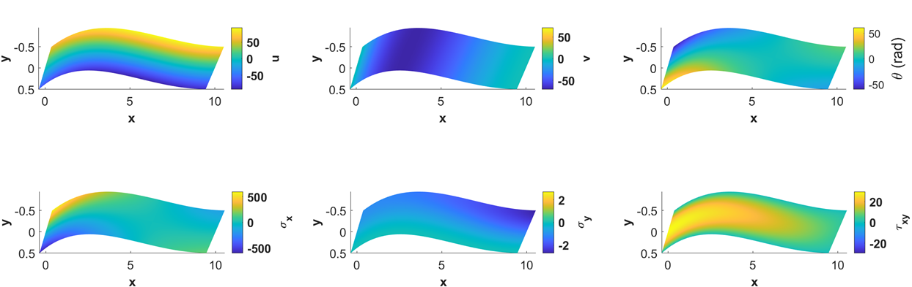
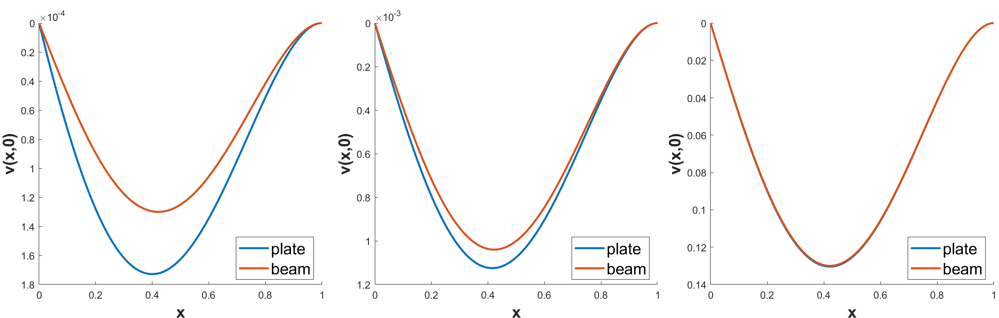
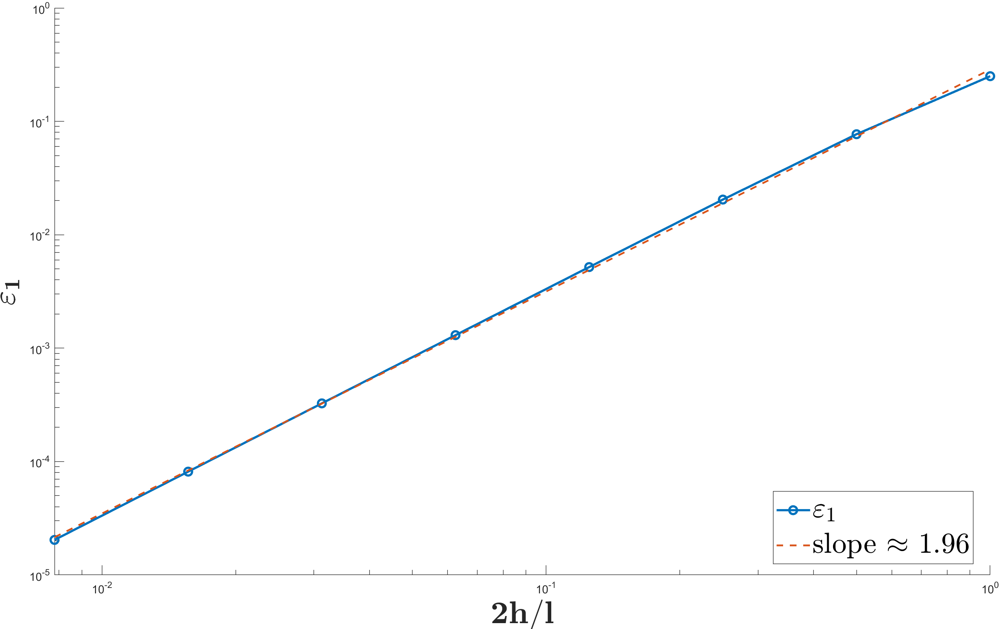

# Biharmonic Plate Solution

This repository implements a numerical solver for the in-plane displacements and stresses of a **propped-cantilever rectangular plate** subjected to a **transverse continuous load**. The solution is based on Airy stress functions, weak clamping at the fixed end, and superposition with a concentrated reaction to enforce the prop. The README summarizes the accompanying report and reproduces its figures.



## Theory

For a linearly elastic plate, the Airy stress function \(\Phi(x,y)\) identically satisfies **equilibrium** and enforces **compatibility** via the biharmonic equation
\[
\nabla^{4}\Phi(x,y)=q(x,y).
\]
Stresses are recovered from \(\Phi\) in the usual way. In-plane displacements \(u(x,y)\) and \(v(x,y)\) follow from integrating the plane-stress strains and then enforcing **shear compatibility**,
\[
u_{,y}+v_{,x}=\tfrac{1}{G}\,\tau_{xy},\qquad G=\frac{E}{2(1+\nu)}.
\]

**Weak clamping.** Clamping at the fixed end is imposed weakly using one of two equivalent constraints at the midline:
- \(v_{,x}(l,0)=0\) (horizontal filament), or
- \(u_{,y}(l,0)=0\) (vertical filament).

These variants differ by a rigid-motion allocation but produce the same physical clamp when stresses are matched.



## Results

**Deformation fields (continuous load).** Cantilevers with slenderness ratios \(2h/l=1\) and \(0.1\) highlight the boundary-layer near the weak clamp and the increasing agreement with beam theory as the plate thins.


**Propped cantilever (superposed solution).** The continuous-load field is superposed with a unit-load solution scaled so that \(v(0,0)=0\). Below are representative displacement and stress fields for \(2h/l=0.1\).


## Convergence Study

We compare midline deflection against Euler–Bernoulli (EB) beam predictions across slenderness. The error decays approximately quadratically with \(2h/l\) (slope \(p\approx 2\)) and yields a practical rule-of-thumb for target accuracy.



**Log–log error.** If \(\varepsilon_1\) denotes the mean absolute relative error in midline deflection, a representative fit gives
\[
\varepsilon_1 \;\approx\; C\,(2h/l)^{\,p},\qquad p\approx 2,\; C\approx 0.33,
\]
so to achieve a desired \(\varepsilon_1^\star\),
\[
(2h/l)^\star \;\approx\; \sqrt{3\,\varepsilon_1^\star}.
\]



## Running the code

The scripts are written for MATLAB. To reproduce figures:

```matlab
% at the MATLAB prompt
>> Main

```

`Main.m` constructs `Plate` objects for several slenderness values and calls the plotting routines.  Additional plots such as `plot_displacement_exp` or `plot_stresses_exp` can be enabled in `Main.m`.

## References

1. Timoshenko & Goodier, Theory of Elasticity, 1951.
2. Reddy, Theory and Analysis of Elastic Plates and Shells, 2006.
3. Ding et al., “Analytical solution for fixed-end beam subjected to uniform load,” JZUS-A, 2005.
4. Timoshenko, 1921 shear correction for prismatic bars.
